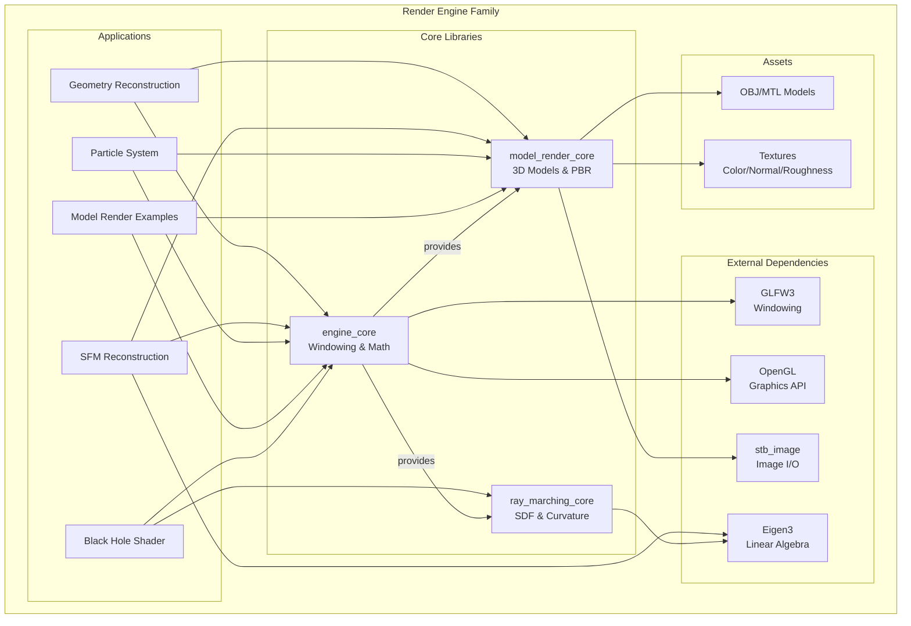
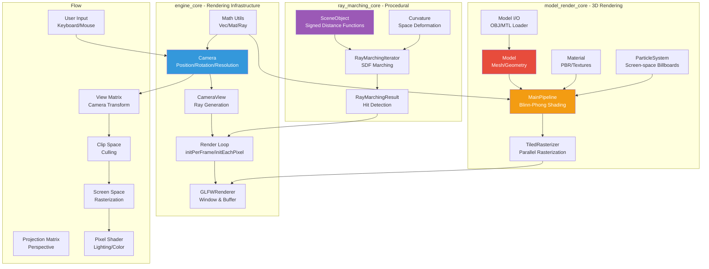
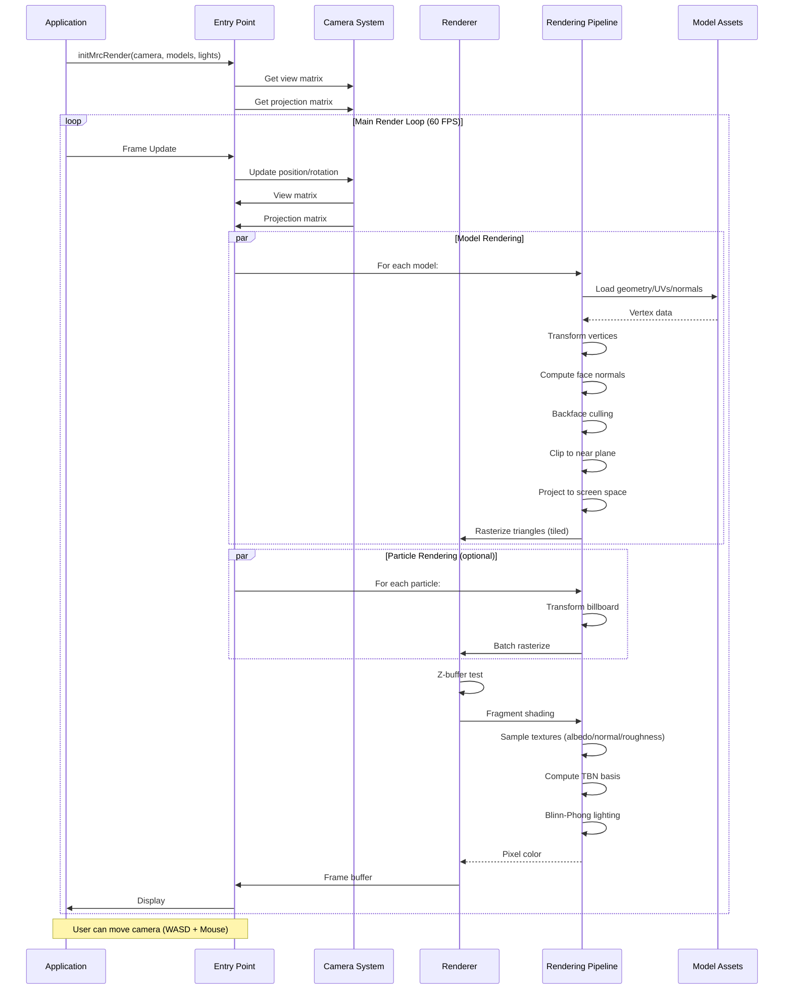

# Render Engine Family


A modern C++20 rendering engine family featuring ray marching, 3D model rendering with PBR materials, and computer vision capabilities. Built with a modular architecture, it provides a comprehensive foundation for real-time graphics research and applications.

## Table of Contents

- [Quickstart](#quickstart)
- [Features](#features)
- [Architecture](#architecture)
- [Tech Stack](#tech-stack)
- [Project Structure](#project-structure)
- [Examples](#examples)
- [Configuration](#configuration)
- [Development](#development)
- [Troubleshooting](#troubleshooting)
- [Roadmap](#roadmap)
- [Contributing](#contributing)
- [License](#license)

## Quickstart

Get up and running in minutes:

### Prerequisites

- **CMake** 3.15 or higher
- **C++20 compatible compiler** (GCC 10+, Clang 12+, MSVC 19.28+)
- **GLFW3** for windowing

For SFM examples only:
- **Eigen3** for linear algebra
- **COLMAP** for 3D reconstruction

For geometry reconstruction examples only:
- **Manifold** library for 3D operations

### Building

```bash
# Clone repository (replace with your fork URL)
git clone <your-fork-url>/render_engine_family.git
cd render_engine_family

# Create build directory
mkdir build && cd build

# Configure with CMake
cmake ..

# Build all targets
cmake --build .
```

### Running Examples

```bash
# Run from build directory
cd build

# Simple ray tracer
./engine_core_examples/simple_ray_tracer

# 3D model rendering
./model_render_core_example

# Black hole shader (ray marching)
./black_hole_shader

# Particle system
./particles_exmaple

# Texture example with PBR
./mrc_texture_example
```

Or build and run a specific target:

```bash
cmake --build . --target simple_ray_tracer
./engine_core_examples/simple_ray_tracer
```

## Features

### Core Capabilities

- **Modular Architecture** - Three independent core libraries for different rendering paradigms
- **CPU-based Rasterization** - Tiled parallel rasterizer with z-buffer support
- **Screen-Space Particle Rendering** - Efficient impostor billboard system with SoA layout
- **PBR Material System** - Physically based rendering with diffuse, normal, and roughness maps
- **Multiple Rendering Modes** - Frame-based and pixel-by-pixel rendering loops
- **Cross-platform** - CMake-based build system supporting Windows, macOS, and Linux

### Rendering Techniques

- **Blinn-Phong Shading** - With TBN basis for normal mapping (see [model_render_core/include/main_pipeline.h](model_render_core/include/main_pipeline.h))
- **Texture Mapping** - UV coordinates, tangent space transformations
- **Backface Culling** - View-space optimization
- **Z-Buffer Depth Testing** - Proper occlusion handling
- **Camera Controls** - WASD movement + mouse look

### 3D Model Support

- **OBJ/MTL Format** - Wavefront OBJ model loading
- **Multi-Material Support** - Per-face material assignment
- **Texture Channels** - Color, normal, and roughness maps
- **PBR Textures** - High-resolution texture support (see `examples/mrc_texture_example/objects/`)

### Advanced Features

- **Ray Marching** - Signed Distance Function (SDF) rendering
- **Curved Space Rendering** - For black hole and gravitational effects
- **Structure from Motion** - 3D reconstruction from images (COLMAP integration)
- **Geometry Reconstruction** - Computational geometry with Manifold

## Architecture

### High-Level Overview



### Component Breakdown



The engine consists of three core modules:

#### **engine_core** - Rendering Infrastructure

Base rendering framework providing:
- **Camera System** - Position, rotation, resolution, and projection (see [engine_core/include/camera/](engine_core/include/camera/))
- **Window Management** - GLFW integration with event handling (see [engine_core/include/glfw_render.h](engine_core/include/glfw_render.h))
- **Math Utilities** - Vec, Mat, and Ray types (see [engine_core/include/utils/](engine_core/include/utils/))
- **Render Loops** - Frame-based and per-pixel rendering modes (see [engine_core/include/entry_point.h](engine_core/include/entry_point.h))
- **Entry Points** - Templates for different rendering workflows

Key entry points:
- `initPerFrameRender()` - For full-frame rendering
- `initEachPixelRender()` - For ray marching/per-pixel operations

#### **model_render_core** - 3D Model Rendering

Complete 3D rendering pipeline:
- **Model Loading** - OBJ/MTL file format support (see [model_render_core/include/model/io.h](model_render_core/include/model/io.h))
- **Material System** - PBR with albedo, normal, and roughness maps (see [model_render_core/include/model/material.h](model_render_core/include/model/material.h))
- **Particle System** - Screen-space impostor rendering with customizable billboards (see [model_render_core/include/particle_system.h](model_render_core/include/particle_system.h))
- **Shading Pipeline** - Blinn-Phong with TBN basis for normal mapping
- **Rasterization** - Tiled parallel rasterizer with z-buffer (see [model_render_core/include/utils/tiled_rasterizer.h](model_render_core/include/utils/tiled_rasterizer.h))

Key entry point:
- `initMrcRender()` - Main rendering loop for models

#### **ray_marching_core** - Procedural Rendering

Ray marching implementation for procedural content:
- **SDF Objects** - Signed Distance Function primitives (see [ray_marching_core/include/object/](ray_marching_core/include/object/))
- **Ray Marching Iterator** - Configurable marching algorithm
- **Curvature System** - Space deformation for curved space effects (see [ray_marching_core/include/curvature/](ray_marching_core/include/curvature/))
- **Material Integration** - Compatible with shading pipeline

### Request Flow



Typical render flow for a model rendering application:

1. Camera creates view and projection matrices
2. Models are transformed to world space
3. Backface culling removes invisible triangles
4. Clipping against near plane
5. Projection to screen space
6. Tiled rasterization generates fragments
7. Z-buffer testing handles occlusion
8. Fragment shader samples textures and computes lighting
9. Final colors written to framebuffer

See [docs/architecture/](docs/architecture/) for detailed diagrams.

## Tech Stack

| Component | Technology |
|-----------|------------|
| **Language** | C++20 |
| **Build System** | CMake 3.15+ |
| **Windowing** | GLFW3 |
| **Math** | Eigen3 (SFM examples) |
| **Image I/O** | stb_image (embedded) |
| **Geometry** | Manifold (geometry reconstruction) |
| **3D Reconstruction** | COLMAP (SFM examples) |
| **Parallelization** | OpenMP |

## Project Structure

```
render_engine_family/
├── CMakeLists.txt              # Main build configuration
├── .gitignore
│
├── engine_core/                # Base rendering infrastructure
│   ├── include/
│   │   ├── camera/            # Camera system
│   │   ├── utils/             # Math utilities (vec, mat, ray)
│   │   ├── entry_point.h      # Render loop templates
│   │   ├── glfw_render.h      # GLFW integration
│   │   └── ...
│
├── model_render_core/          # 3D model rendering
│   ├── include/
│   │   ├── model/             # Model loading and representation
│   │   ├── particle_system.h  # Screen-space particle system
│   │   ├── main_pipeline.h    # Rendering pipeline
│   │   └── utils/             # Rasterization, projection, etc.
│
├── ray_marching_core/         # Ray marching engine
│   ├── include/
│   │   ├── object/            # SDF objects
│   │   ├── curvature/         # Curvature calculation
│   │   └── ...
│
├── examples/                   # Example applications
│   ├── engine_core_examples/   # Basic ray tracing demos
│   ├── model_render_core_example/  # 3D model rendering
│   ├── particles_exmaple/     # Particle system demo
│   ├── black_hole_shader/     # Curved space ray marching
│   ├── mrc_texture_example/   # PBR texture mapping
│   ├── triangle_lightning_example/
│   ├── geometry_model_reconstruction/
│   └── sfm_model_reconstruction/
│
└── docs/                       # Documentation
    └── architecture/          # Architecture diagrams
```

## Examples

### Engine Core Examples

Located in `examples/engine_core_examples/`

- **simple_ray_tracer** - Basic ray tracing with sphere intersection
- **color_check** - Color validation and testing
- **hole_frame_color_check** - Frame boundary testing

### Model Rendering Examples

#### Basic 3D Rendering (`examples/model_render_core_example/`)
Demonstrates basic 3D model loading and rendering with simple materials.

**Usage:**
```cpp
sc::Camera<float, sc::VecArray> camera;
camera.pos()[2] = 2.0f;
camera.setLen(0.3);

auto models = loadModels({ "cube.obj", "fractal.obj", "monke.obj" });
auto lights = { LightSource{/*pos*/ {0, 3, 0}, /*dir*/ {0, -1, 0}, /*color*/ {1,1,1}, /*intensity*/ 1.0f} };

mrc::initMrcRender(camera, models, lights);
```

#### PBR Texture Example (`examples/mrc_texture_example/`)
Shows physically-based rendering with high-resolution textures:
- Color map (albedo)
- Normal map (tangent space)
- Roughness map (specular control)

**Assets:**
- `rock.obj` - High-detail rock model
- `rock.mtl` - Material definitions
- High-resolution texture maps (see `objects/` directory)

#### Particle System (`examples/particles_exmaple/`)
Demonstrates screen-space particle impostor rendering:
- Thousands of particles (configurable, see [examples/particles_exmaple/main.cpp](examples/particles_exmaple/main.cpp#L81))
- Circular billboard approximation (8 segments)
- Per-particle size and color
- Real-time update (rotation animation)

**Controls:**
- Particles rotate around center
- Colors gradient from white to orange

#### Triangle Lightning (`examples/triangle_lightning_example/`)
Simple triangle-based rendering with custom materials.

### Ray Marching Examples

#### Black Hole Shader (`examples/black_hole_shader/`)
Implements curved space rendering for gravitational effects:
- SDF-based ray marching
- Curvature calculation for space-time distortion
- Real-time interactive rendering

### Computer Vision Examples

#### SFM Reconstruction (`examples/sfm_model_reconstruction/`)
Structure from Motion implementation using COLMAP:
- 3D reconstruction from image sets
- Camera pose estimation
- Dense reconstruction
- Requires Eigen3 and COLMAP

#### Geometry Reconstruction (`examples/geometry_model_reconstruction/`)
3D model processing with computational geometry:
- Model intersection operations
- Manifold library integration
- Solid modeling operations

### Camera Controls

All model rendering examples share the same controls (see [model_render_core/include/main_pipeline.h](model_render_core/include/main_pipeline.h#L432-L447)):

| Key | Action |
|-----|--------|
| **W/S** | Move forward/backward |
| **A/D** | Move left/right |
| **Left Shift** | Move up |
| **Left Ctrl** | Move down |
| **Mouse** | Rotate camera (drag) |

## Configuration

### Build Configuration

Build configuration is handled through CMake. Key options (see root [CMakeLists.txt](CMakeLists.txt)):

```cmake
# C++20 is required
set(CMAKE_CXX_STANDARD 20)
set(CMAKE_CXX_STANDARD_REQUIRED ON)

# Default build type
set(CMAKE_BUILD_TYPE Release)
```

### Camera Configuration

Camera can be configured programmatically (see [engine_core/include/camera/camera.h](engine_core/include/camera/camera.h)):

```cpp
sc::Camera<float, sc::VecArray> camera;

// Position (x, y, z)
camera.pos() = {0.f, 0.f, 2.f};

// Rotation (pitch, yaw, roll in radians)
camera.rot() = {0.f, 0.f, 0.f};

// Resolution (width, height in pixels)
camera.setRes({1000, 800});

// Focal length (meters)
camera.setLen(0.3f);

// Screen size (width, height in meters)
camera.setSize({0.8f, 0.6f});
```

### Render Configuration

```cpp
// Target frame rate
unsigned int targetFrameRateMs = 60;

// Window resolution (default: camera resolution)
sc::utils::Vec<int, 2> windowResolution = {-1, -1};

// Custom key handlers
std::vector<std::pair<std::vector<int>, std::function<void()>>> keyHandlers = {
    {{GLFW_KEY_SPACE}, []() { /* action */ }}
};

// Mouse handler
auto mouseHandler = [](double dx, double dy) {
    /* rotation logic */
};
```

### Material Configuration

Materials can be defined in MTL files or programmatically (see [model_render_core/include/model/material.h](model_render_core/include/model/material.h)):

```cpp
mrc::Material material;
material.baseColor = {0.8f, 0.2f, 0.2f};  // RGB [0,1]
material.ambient = 0.1f;
material.specular = 0.5f;
material.shininess = 64.0f;

// Textures
material.diffuseMap = loadTexture("color.jpg");
material.normalMap = loadTexture("normal.jpg");
material.roughnessMap = loadTexture("roughness.jpg");
```

## Development

### Building from Source

```bash
# Clone repository (replace with your fork URL)
git clone <your-fork-url>/render_engine_family.git
cd render_engine_family

# Create build directory
mkdir build && cd build

# Configure
cmake .. -DCMAKE_BUILD_TYPE=Release

# Build (use --parallel for cross-platform, or -j$(nproc) on Linux/macOS)
cmake --build . --parallel

# Run an example
./engine_core_examples/simple_ray_tracer
```

### Project Files

- **CMakeLists.txt** - Main build configuration
- **CMakeLists.txt** (per module) - Module-specific configuration

### Code Style

The project uses modern C++20 features (see [CMakeLists.txt](CMakeLists.txt#L5)):
- Templates for generic algorithms
- Lambda expressions for callbacks
- Structured bindings
- Range-based for loops
- `auto` type deduction where appropriate

### Adding a New Example

1. Create a new directory in `examples/`
2. Add `CMakeLists.txt` with your target:
   ```cmake
   add_executable(my_example main.cpp)
   target_link_libraries(my_example PRIVATE engine_core model_render_core)
   ```
3. Add to root `CMakeLists.txt`:
   ```cmake
   add_subdirectory(examples/my_example)
   ```
4. Implement your example

See [docs/development.md](docs/development.md) for detailed guide.

## Troubleshooting

### Build Issues

**CMake not found:**
```bash
# Ubuntu/Debian
sudo apt install cmake

# macOS
brew install cmake

# Windows
# Install via package manager or download from official site
```

**GLFW not found:**
```bash
# Ubuntu/Debian
sudo apt install libglfw3-dev

# macOS
brew install glfw

# Windows
# Install via vcpkg or download from official site
```

**Eigen3 not found (for SFM examples):**
```bash
# Ubuntu/Debian
sudo apt install libeigen3-dev

# macOS
brew install eigen
```

### Runtime Issues

**Window doesn't open:**
- Ensure OpenGL drivers are installed and up to date
- Check that GLFW is properly linked

**Models not rendering:**
- Verify OBJ/MTL files exist
- Check file paths are correct (relative to executable)
- Enable logging by uncommenting `add_compile_definitions(ENABLE_LOG)` in root [CMakeLists.txt](CMakeLists.txt#L9)

**Textures not loading:**
- Check image file formats (JPG/PNG supported via stb_image, see [model_render_core/include/model/thirdparty/stb_image.h](model_render_core/include/model/thirdparty/stb_image.h))
- Verify file paths
- Check texture dimensions

## Roadmap

### Planned Features

- [ ] GPU-based rendering with OpenGL/Vulkan
- [ ] More SDF primitives in ray_marching_core
- [ ] Shadow mapping
- [ ] Post-processing effects (bloom, DOF, tone mapping)
- [ ] Additional 3D format support (GLTF, FBX)
- [ ] Level-of-detail (LOD) system
- [ ] Occlusion culling
- [ ] Profiling and optimization tools
- [ ] Unit tests for core modules
- [ ] CI/CD pipeline with GitHub Actions

### Known Limitations

- CPU-based rendering only (no GPU acceleration)
- Rendering capabilities limited to CPU performance
- SFM example requires external COLMAP installation

## Contributing

Contributions are welcome! See [CONTRIBUTING.md](CONTRIBUTING.md) for detailed guidelines.

### Setup

1. Fork the repository
2. Create a feature branch: `git checkout -b feature/my-feature`
3. Make your changes
4. Test thoroughly
5. Submit a pull request

### Guidelines

- Follow the existing code style (C++20 features)
- Add examples for new features
- Update documentation as needed
- Keep examples self-contained
- Use meaningful commit messages

### Areas for Contribution

- Additional example programs
- Performance optimizations
- Bug fixes
- Documentation improvements
- New SDF objects for ray marching
- Additional shader implementations
- Model format support

## License

This project is proprietary software. All rights reserved.

## Credits

Developed as a family of rendering engines for graphics research and applications.

**Dependencies:**
- [GLFW](https://www.glfw.org/) - Window and input management
- [stb](https://github.com/nothings/stb) - Image loading utilities
- [Eigen](http://eigen.tuxfamily.org/) - Linear algebra
- [COLMAP](https://colmap.github.io/) - 3D reconstruction
- [Manifold](https://github.com/elalish/manifold) - Computational geometry
