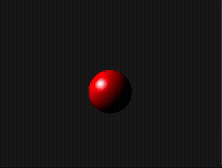
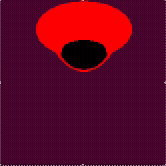
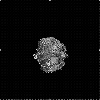
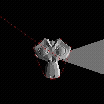

# a few render engines

firstly it was a project designed for rendering curved 4d shapes surfaces but I haven't done it yet :D

but here's a few pretty fun render engines are implemented

---

## examples

#### PS all the footages framerate is scaled down 'cuz I converted 'em to gif, originally they were in 60 fps

### simple ray tracing

---

### ray marching

it also not complete btw)

---

### model rendering

---

### and I also added model reconstruction by snapshots

---

## Implementation

### Shader core

### Other cores

